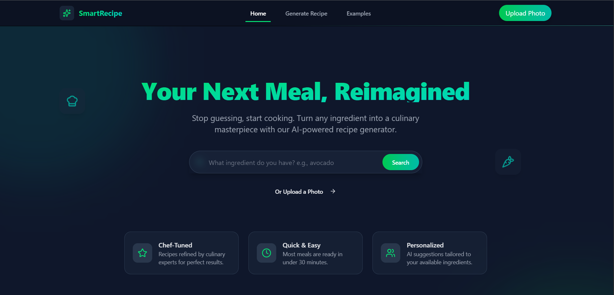

📖 Table of Contents

    About The Project

    ✨ Features

    🛠️ Built With

    🚀 Getting Started

        Prerequisites

        Installation

    ⚙️ Configuration

    🧩 Usage

    🧪 Running Tests

    🤝 Contributing

    📄 License

    📞 Contact

📝 About The Project

This Recipe Generator was created to solve a common household problem: having a pantry full of ingredients but no idea what to make. This tool allows users to input the ingredients they have on hand and receive a curated list of delicious recipes. It can also filter by dietary needs, cuisine type, cooking time, and more, making meal planning simple and fun.

✨ Features

    Ingredient-Based Search: Find recipes using the ingredients you already have.

    Advanced Filtering: Filter results by cuisine, diet, and meal type.

    Real-time Database: Recipes and user favorites are stored and synced instantly with Firestore.

    Secure Authentication: User accounts are managed securely with Firebase Authentication.

    Serverless Functions: Backend logic is handled by Cloud Functions for scalability.

    Save Your Favorites: Logged-in users can save their favorite recipes for later.

🛠️ Built With

This project is built with modern JavaScript technologies and is powered by the Firebase platform.

    Frontend:

        React

        Vite (or Create React App)

    Backend & Infrastructure:

        Firebase Platform

        Authentication: Firebase Authentication

        Database: Cloud Firestore

        Backend Logic: Cloud Functions for Firebase

        Hosting: Firebase Hosting

    API:

        Spoonacular API (or another recipe data provider)

🚀 Getting Started

To get a local copy up and running, follow these simple steps.

Prerequisites

Make sure you have Node.js and the Firebase CLI installed.

    Node.js (v18.x or later recommended)

    NPM (comes with Node.js)

    Firebase CLI
    Bash

    npm install -g firebase-tools

Installation

    Clone the repository:
    Bash

git clone https://github.com/your-username/recipe-generator.git
cd recipe-generator

Install frontend dependencies:
Bash

npm install

Install backend (Cloud Functions) dependencies:
Bash

cd functions
npm install
cd ..

Connect to your Firebase project:
Log in to Firebase and initialize the project.
Bash

    firebase login
    firebase use --add

    Then select your Firebase project from the list.

⚙️ Configuration

This project requires a Firebase configuration object to connect to your Firebase services.

    Get your Firebase config:

        Go to your Firebase project console.

        Click the gear icon > Project settings.

        In the "Your apps" card, select the Web app (</>).

        Under "Firebase SDK snippet", choose Config and copy the firebaseConfig object.

    Create an environment file:
    In the root of your project, create a file named .env.local.
    Bash

cp .env.example .env.local

Add your Firebase and API keys to .env.local:
Note: If using Create React App, prefixes must be REACT_APP_. If using Vite, prefixes must be VITE_.
Code snippet

    # For Vite
    VITE_FIREBASE_API_KEY="your-api-key"
    VITE_FIREBASE_AUTH_DOMAIN="your-project-id.firebaseapp.com"
    VITE_FIREBASE_PROJECT_ID="your-project-id"
    VITE_FIREBASE_STORAGE_BUCKET="your-project-id.appspot.com"
    VITE_FIREBASE_MESSAGING_SENDER_ID="your-sender-id"
    VITE_FIREBASE_APP_ID="your-app-id"

    # External Recipe API Key
    VITE_RECIPE_API_KEY="YOUR_SPOONACULAR_API_KEY_HERE"

🧩 Usage

This project uses the Firebase Local Emulator Suite to run the entire backend locally for easy development.

    Start the Firebase Emulators:
    This will start local instances of Authentication, Firestore, and Functions.
    Bash

firebase emulators:start

In a new terminal window, start the React frontend:
Bash

    npm run dev

    Open your browser and navigate to http://localhost:5173 (or the port shown in your terminal).

Deployment

To deploy your application to Firebase Hosting and Cloud Functions:
Bash

firebase deploy

🧪 Running Tests

To run the automated tests for this system:

    For the frontend (React components):
    Bash

npm test

For the backend (Cloud Functions):
Bash

    cd functions
    npm test

🤝 Contributing

Contributions are what make the open-source community such an amazing place to learn, inspire, and create. Any contributions you make are greatly appreciated.

If you have a suggestion that would make this better, please fork the repo and create a pull request. You can also simply open an issue with the tag "enhancement".

    Fork the Project

    Create your Feature Branch (git checkout -b feature/AmazingFeature)

    Commit your Changes (git commit -m 'Add some AmazingFeature')

    Push to the Branch (git push origin feature/AmazingFeature)

    Open a Pull Request

📄 License

Distributed under the MIT License. See LICENSE.txt for more information.

📞 Contact

[Your Name] - [@your_twitter] - your_email@example.com

Project Link: https://github.com/your-username/recipe-generator