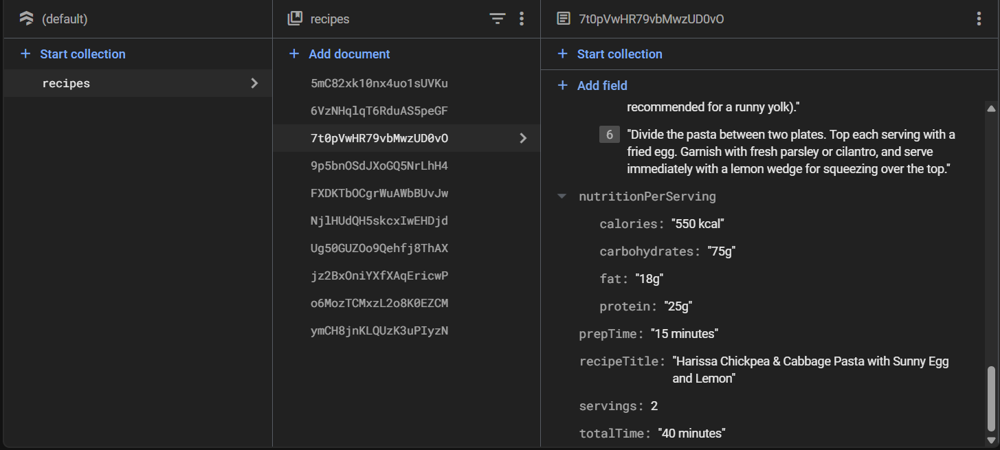

# 🍳 Recipe Generator

<p align="center">
  
  
  
  
</p>

A smart application to help you discover recipes based on the ingredients you have. Leveraging machine learning, you can even snap a photo of your ingredients, and the app will identify them for you. Say goodbye to the eternal question: "What's for dinner?"

**Live Demo:** [**recipe-generator-ml.vercel.app/**](recipe-generator-ml.vercel.app/)

---

## 📖 Table of Contents

- [📝 About The Project](#-about-the-project)
- [✨ Features](#-features)
- [🛠️ Tech Stack](#️-tech-stack)
- [📂 Project Structure](#-project-structure)
- [🚀 Getting Started](#-getting-started)
- [⚙️ Configuration](#️-configuration)
- [🧩 Usage](#-usage)
- [🤝 Contributing](#-contributing)
- [📄 License](#-license)
- [📬 Contact](#-contact)

---

## 📝 About The Project

This Recipe Generator was created to solve a common household problem: having a pantry full of ingredients but no idea what to make. This tool allows users to manually input ingredients or use their device's camera to automatically detect them. The app then fetches a curated list of delicious recipes, making meal planning simple and fun.

---

## ✨ Features

-   📸 **Image-Based Ingredient Recognition**: Snap a photo of your ingredients, and the app's custom-trained YOLO model will automatically detect and list them.
-   📝 **Ingredient-Based Search**: Find recipes using a list of ingredients from a vast dataset using Yolo.
-   💾 **Real Time Recipe generation**: Generate recipe using the gemini api.
-   ⚙️ **Advanced Filtering**: Filter results by cuisine, diet (e.g., Vegan, Gluten-Free), and meal type.
-   ☁️ **Real-time Database**: User favorites are stored and synced instantly with Cloud Firestore.
-   🔐 **Secure Authentication**: User accounts are managed securely with Firebase Authentication.
-   💾 **Save Your Favorites**: Logged-in users can save their favorite recipes for later.


---


## 🛠️ Tech Stack


This project uses a modern tech stack, combining a powerful frontend, a Python backend, and custom machine learning models.

| Category                | Technologies                                                                          |
| ----------------------- | ------------------------------------------------------------------------------------- |
| **Frontend** | `React`, `Vite`, `Tailwind CSS`                                                       |
| **Backend** | `Python`, `FastAPI` (or Flask)                                                        |
| **Database** | `Firebase Firestore`                                                                  |
| **Authentication** | `Firebase Authentication`                                                             |
| **ML / AI** | `YOLOv8`, `scikit-learn`, `Roboflow`, `Google Gemini API`                              |
| **Deployment/Hosting** | `Vercel` (for Frontend), `Firebase Hosting`, `Render` (for Backend)                   |

---

## 📂 Project Structure

This project is a monorepo, containing both the frontend and backend code in a single repository.

/
├── backend/      # Contains the Python backend (FastAPI/Flask)
└── frontend/     # Contains the React (Vite) frontend application


---



## 🚀 Getting Started

To get a local copy up and running, follow these steps.

### Prerequisites

Make sure you have the following installed:
- Node.js (v18.x or later)
- Python (v3.9 or later) & pip
- npm (Node Package Manager)

### Installation & Setup

1.  **Clone the repository:**
    ```bash
    git clone [https://github.com/SuyashJoshi007/RecipeGeneratorML.git](https://github.com/SuyashJoshi007/RecipeGeneratorML.git)
    cd RecipeGeneratorML
    ```

2.  **Setup the Backend:**
    ```bash
    cd backend
    python -m venv venv
    source venv/bin/activate  # On Windows, use `venv\Scripts\activate`
    pip install -r requirements.txt
    cd ..
    ```

3.  **Setup the Frontend:**
    ```bash
    cd frontend
    npm install
    ```

---

## ⚙️ Configuration

The project requires environment variables to connect to Firebase and other services.

1.  **Frontend Configuration:**
    - Navigate to the `frontend` directory: `cd frontend`
    - Create a `.env.local` file by copying the example: `cp .env.example .env.local`
    - Add your Firebase and API keys to `.env.local`. **Remember to prefix them with `VITE_`**.
      ```.env
      # Firebase Configuration
      VITE_FIREBASE_API_KEY="your-api-key"
      VITE_FIREBASE_AUTH_DOMAIN="your-project-id.firebaseapp.com"
      VITE_FIREBASE_PROJECT_ID="your-project-id"
      # ... and so on

      # Google Gemini API Key
      VITE_GEMINI_API_KEY="YOUR_GEMINI_API_KEY_HERE"
      ```

2.  **Backend Configuration:**
    - If your backend requires API keys (e.g., for Gemini), create a `.env` file inside the `backend` directory and add them there.

---

## 🧩 Usage

To run the application locally, you'll need to start both the backend and frontend servers in separate terminals.

1.  **Start the Backend Server:**
    - Open a terminal in the project root.
    ```bash
    cd backend
    source venv/bin/activate # Activate the virtual environment
    uvicorn main:app --reload  # Or your command to run the backend
    ```
    The backend will typically run on `http://127.0.0.1:8000`.

2.  **Start the Frontend Development Server:**
    - Open a **new** terminal in the project root.
    ```bash
    cd frontend
    npm run dev
    ```
    The frontend will be available at `http://localhost:5173` (or the port shown in your terminal).

---

## 🤝 Contributing

Contributions are greatly appreciated. Please fork the repository and open a pull request.

1.  Fork the Project
2.  Create your Feature Branch (`git checkout -b feature/AmazingFeature`)
3.  Commit your Changes (`git commit -m 'Add some AmazingFeature'`)
4.  Push to the Branch (`git push origin feature/AmazingFeature`)
5.  Open a Pull Request

---

## 📄 License

Distributed under the MIT License. See `LICENSE.txt` for more information.

---

## 📬 Contact

Suyash Joshi - [@SuyashJoshi007](https://github.com/SuyashJoshi007)

Project Link: [https://github.com/SuyashJoshi007/RecipeGeneratorML](https://github.com/SuyashJoshi007/RecipeGeneratorML)
